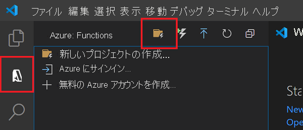
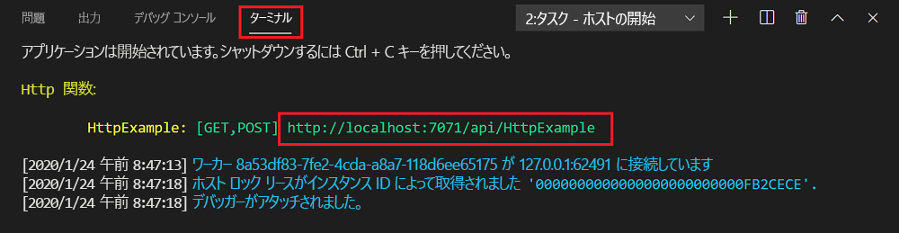
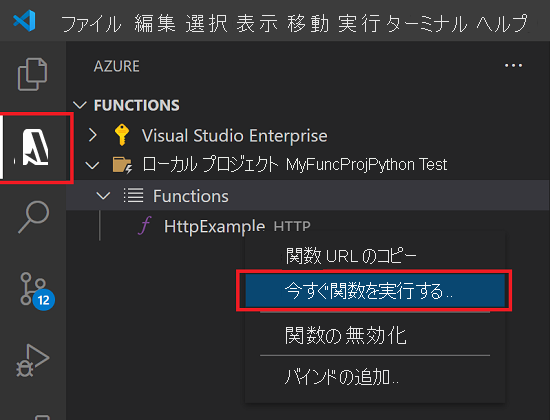
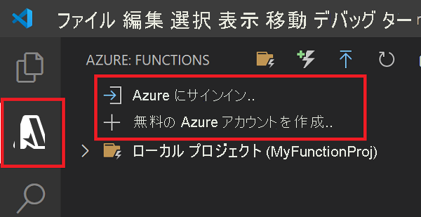
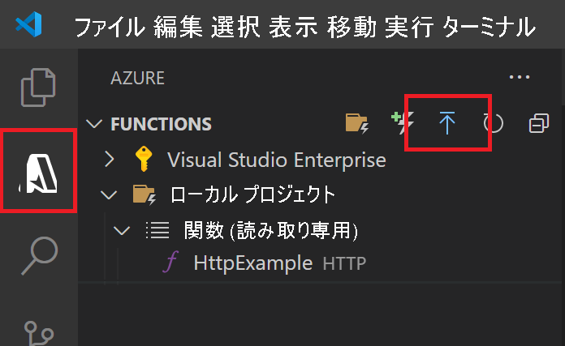
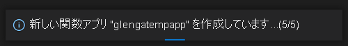
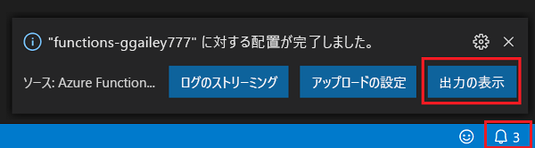
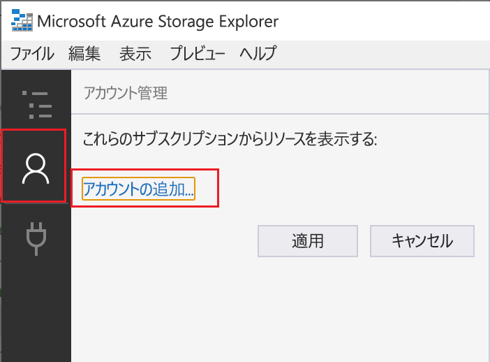
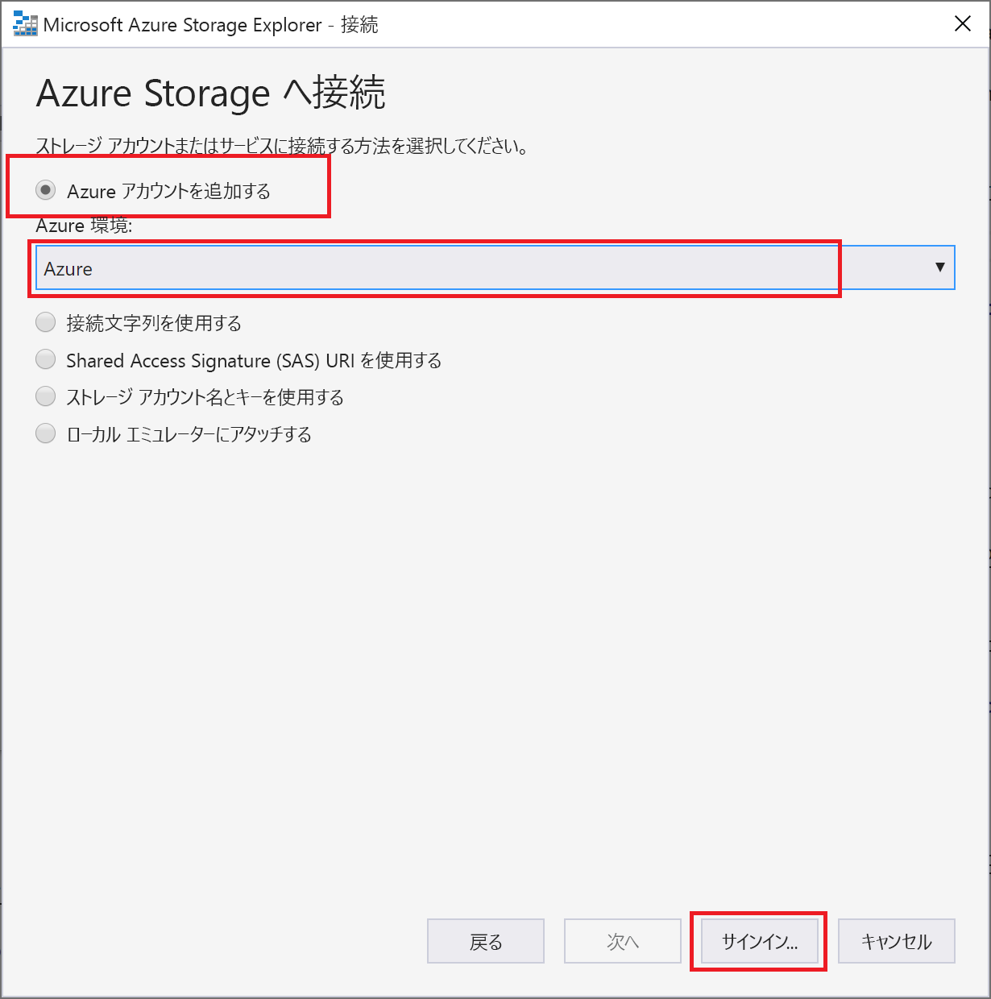
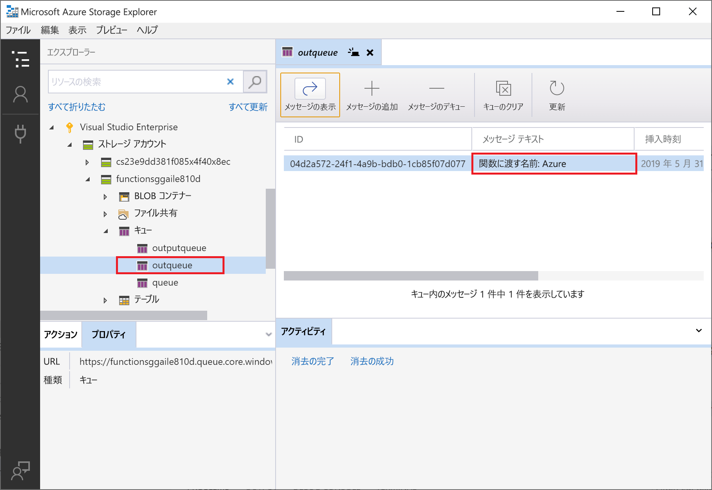

# Visual Studio Code を使用して Azure に Java 関数を作成する


- [Visual Studio Code を使用して Azure に Java 関数を作成する](#visual-studio-code-を使用して-azure-に-java-関数を作成する)
- [ローカル プロジェクトを作成する](#ローカル-プロジェクトを作成する)
- [関数をローカルで実行する](#関数をローカルで実行する)
- [Azure へのサインイン](#azure-へのサインイン)
- [Azure にプロジェクトを発行する](#azure-にプロジェクトを発行する)
- [Azure で関数を実行する](#azure-で関数を実行する)
- [Azure Functions を Azure Storage に接続する](#azure-functions-を-azure-storage-に接続する)
- [ローカル環境を構成する](#ローカル環境を構成する)
- [関数アプリの設定をダウンロードする](#関数アプリの設定をダウンロードする)
  - [2. 前の記事で作成した関数アプリを選択します。 [すべてはい] を選択して既存のローカル設定を上書きします。](#2-前の記事で作成した関数アプリを選択します-すべてはい-を選択して既存のローカル設定を上書きします)
- [バインディング拡張機能を登録する](#バインディング拡張機能を登録する)
- [出力バインディングを追加する](#出力バインディングを追加する)
- [出力バインディングを使用するコードを追加する](#出力バインディングを使用するコードを追加する)
- [テストを更新する](#テストを更新する)
- [関数をローカルで実行する](#関数をローカルで実行する-1)
- [ストレージ エクスプローラーをアカウントに接続する](#ストレージ-エクスプローラーをアカウントに接続する)
- [出力キューを確認する](#出力キューを確認する)
- [更新したアプリを再デプロイして検証する](#更新したアプリを再デプロイして検証する)
- [リソースをクリーンアップする](#リソースをクリーンアップする)
- [補足 (次のステップ)](#補足-次のステップ)


# ローカル プロジェクトを作成する
このセクションでは、Visual Studio Code を使用して、ローカル Azure Functions プロジェクトを Java で作成します。 後からこの記事の中で、関数コードを Azure に発行します。

1. アクティビティ バーの Azure アイコンを選択し、 [Azure: Functions] 領域で [新しいプロジェクトの作成] アイコンを選択します。


2. プロジェクト ワークスペースのディレクトリの場所を選択し、 **[選択]** をクリックします。
   - 注意: これらの手順は、ワークスペースの外部で実行するように設計されています。 ここでは、ワークスペースに含まれるプロジェクト フォルダーは選択しないでください。

3. プロンプトで、次の情報を入力します。
   -  Select a language for your function project (関数プロジェクトの言語を選択してください): [`Java`] を選択します。
   -  Select a version of Java (Java のバージョンを選択してください): 関数が Azure で実行される Java バージョン [`Java 11`] または [`Java 8`] を選択します。 ローカルで確認済みの Java バージョンを選択してください。
   -  Provide a group ID (グループ ID を指定してください): [`com.function`] を選択します。
   -  Provide an artifact ID (アーティファクト ID を指定してください): [`myFunction`] を選択します。
   -  Provide a version (バージョンを指定してください): [`1.0-SNAPSHOT`] を選択します。
   -  Provide a package name (パッケージ名を指定してください): [`com.function`] を選択します。
   -  Provide an app name (アプリ名を指定してください): [`myFunction-12345`] を選択します。
   -  [承認レベル]: [Anonymous] を選択します。この場合、すべてのユーザーが関数のエンドポイントを呼び出すことができます。 承認レベルについては、「承認キー」を参照してください。
   -  Select how you would like to open your project (プロジェクトを開く方法を選択してください): **[`Add to workspace`]** を選択します。

4. Visual Studio Code は、この情報を使用して、HTTP トリガーによる Azure Functions プロジェクトを生成します。 ローカル プロジェクト ファイルは、エクスプローラーで表示できます。 作成されるファイルの詳細については、「生成されるプロジェクト ファイル」を参照してください。

# 関数をローカルで実行する
Visual Studio Code を [Azure Functions Core Tools](https://docs.microsoft.com/ja-jp/azure/azure-functions/functions-run-local) と統合することで、このプロジェクトをローカルの開発用コンピューター上で実行してから、Azure に発行することができます。

1. 関数を呼び出すには、F5 キーを押して関数アプリ プロジェクトを起動します。 Core Tools からの出力がターミナル パネルに表示されます。 アプリがターミナル パネルで起動します。 HTTP によってトリガーされる関数の URL エンドポイントがローカルで実行されていることを確認できます。

Windows での実行に問題がある場合、Visual Studio Code の既定のターミナルが WSL Bash に設定されていないことをご確認ください。

2. Core Tools を実行したまま、**Azure: Functions** 領域に移動します。 [Functions] の [ローカル プロジェクト][Functions] を展開します。  関数を右クリック (Windows) または Ctrl キーを押しながらクリック (macOS) して、[Execute Function Now](今すぐ関数を実行) を選択します。


3. [Enter request body](要求本文を入力してください) に、要求メッセージ本文の値として が表示されます。 Enter キーを押して、この要求メッセージを関数に送信します。

4. ローカルで関数を実行し、応答が返されると、Visual Studio Code で通知が発生します。 関数の実行に関する情報は、 [ターミナル] パネルに表示されます。

5. Ctrl + C キーを押して Core Tools を停止し、デバッガーの接続を解除します。

関数がローカル コンピューター上で正常に動作することを確認したら、Visual Studio Code を使用してプロジェクトを直接 Azure に発行します。

---
# Azure へのサインイン
アプリを発行するには、Azure にサインインしておく必要があります。
1. まだサインインしていない場合は、アクティビティ バーの Azure アイコンを選択し、 [Azure: Functions] 領域で、 **[Azure にサインイン...]** を選択します。

既にサインインしている場合は、次のセクションに進んでください。

2. ブラウザーでプロンプトが表示されたら、ご利用の Azure アカウントを選択し、その Azure アカウントの資格情報を使用してサインインします。

3. 正常にサインインしたら、新しいブラウザー ウィンドウを閉じてかまいません。 ご利用の Azure アカウントに属しているサブスクリプションがサイド バーに表示されます。

# Azure にプロジェクトを発行する
このセクションでは、ご利用の Azure サブスクリプションに関数アプリと関連リソースを作成し、コードをデプロイします。

**重要**: 既存の関数アプリに発行すると、Azure のそのアプリのコンテンツが上書きされます

1. アクティビティ バーの Azure アイコンを選択し、 [Azure: Functions] 領域で、 [Deploy to function app](関数アプリにデプロイ) ボタンを選択します。


2. プロンプトで、次の情報を入力します。
- Select folder (フォルダーを選択してください) : ワークスペースのフォルダーを選択するか、関数アプリが格納されているフォルダーを参照します。 既に有効な関数アプリが開いている場合には、このプロンプトは表示されません。
- Select subscription (サブスクリプションを選択してください) : 使用するサブスクリプションを選択します。 サブスクリプションが 1 つのみの場合、このプロンプトは表示されません。
- Select Function App in Azure (Azure で関数アプリを選択してください): [`- Create new Function `] を選択します。 (`Advanced` オプションはこの記事では取り上げません。選択しないでください。)
- Enter a globally unique name for the function app (関数アプリの**グローバルに一意の名前**を入力します) : URL パスに有効な名前を入力します。 入力した名前は、Azure Functions 内での一意性を確保するために検証されます。
- Select a location for new resources (新しいリソースの場所 (リージョン) を選択してください) : パフォーマンスを向上させるために、お近くの[リージョン](https://azure.microsoft.com/regions/) を選択してください。

この拡張機能は、Azure に作成されている個々のリソースの状態を通知領域に表示します。


3. 完了すると、関数アプリ名に基づく名前を使用して、次の Azure リソースがサブスクリプションに作成されます。
- リソース グループ。関連リソースの論理コンテナーです。
- Standard Azure ストレージ アカウント。プロジェクトについての状態とその他の情報を保持します。
- 従量課金プラン。サーバーレス関数アプリの実行環境となるホストを定義します。
- 関数アプリ。関数コードを実行するための環境となります。 関数アプリを使用すると、同じホスティング プランに含まれるリソースの管理、デプロイ、共有を容易にするための論理ユニットとして関数をグループ化できます。
- 関数アプリに接続された Application Insights インスタンス。サーバーレス関数の使用を追跡します。

関数アプリが作成され、展開パッケージが適用されると、通知が表示されます。

**ヒント**: 既定では、関数アプリに必要な Azure リソースが、指定した関数アプリ名に基づいて作成されます。 また、既定では、関数アプリを含んだ同じ新しいリソース グループがその作成先となります。 それらのリソースの名前をカスタマイズしたり、既存のリソースを再利用したりする場合は、高度な作成オプションを使用してプロジェクトを発行する必要があります。

4. この通知の [View Output](出力の表示) を選択すると、作成済みの Azure リソースなど、作成とデプロイの結果が表示されます。 通知を見逃した場合は、右下隅にあるベル アイコンを選択して、再度確認します。



# Azure で関数を実行する
1. [Azure: Functions] 領域 (サイド バー内) に戻り、サブスクリプション、新しい関数アプリ、 [関数] の順に展開します。  関数を右クリック (Windows) または Ctrl キーを押しながらクリック (macOS) して、**[Execute Function Now]** **(今すぐ関数を実行)** を選択します。
.png)

2. [Enter request body](要求本文を入力してください) に、要求メッセージ本文の値として が表示されます。 Enter キーを押して、この要求メッセージを関数に送信します。

3. Azure で関数を実行し、応答が返されると、Visual Studio Code で通知が発生します。

---
# Azure Functions を Azure Storage に接続する
ここでは、Visual Studio Code を使用して、ここまでに作成した関数に Azure Storage を接続します。 この関数に追加する出力バインドは、HTTP 要求のデータを Azure Queue storage キュー内のメッセージに書き込みます。

ほとんどのバインドでは、バインドされているサービスにアクセスするために関数が使用する、保存されている接続文字列が必要です。 作業を簡単にするために、関数アプリで作成したストレージ アカウントを使用します。 このアカウントへの接続は、既に `AzureWebJobsStorage` という名前のアプリ設定に保存されています。

# ローカル環境を構成する
この記事を始める前に、以下の要件を満たす必要があります。
- [Visual Studio Code 用の Azure Storage 拡張機能](https://marketplace.visualstudio.com/items?itemName=ms-azuretools.vscode-azurestorage) をインストールする。
- [Azure Storage Explorer](https://storageexplorer.com/) をインストールする。 Storage Explorer は、出力バインドによって生成されるキュー メッセージの調査に使用するツールです。 Storage Explorer は、macOS、Windows、Linux ベースのオペレーティング システムでサポートされます。

ここでは、Visual Studio Code から Azure サブスクリプションに既にサインインしていることを前提としています。 コマンド パレットから `Azure: Sign In` を実行するとサインインできます。

# 関数アプリの設定をダウンロードする
ここまでで、必要なストレージ アカウントと共に Azure で関数アプリを作成しました。 このアカウントの接続文字列は、Azure のアプリ設定に安全に格納されています。 この記事では、同じアカウントのストレージ キューにメッセージを書き込みます。 関数をローカルで実行しているときにストレージ アカウントに接続するには、アプリ設定を local.settings.json ファイルにダウンロードする必要があります。

1. F1 キーを押してコマンド パレットを開き、コマンド `Azure Functions: Download Remote Settings....` を検索して実行します。

2. 前の記事で作成した関数アプリを選択します。 [すべてはい] を選択して既存のローカル設定を上書きします。
---
**重要**: local.settings.json ファイルは、機密情報が含まれているため、公開されることはなく、ソース管理から除外されます。

---
3. ストレージ アカウントの接続文字列値のキーである `AzureWebJobsStorage` をコピーします。 この接続を使用して、出力バインドが期待どおりに動作することを確認します。

# バインディング拡張機能を登録する
Queue storage の出力バインドを使用しているため、このプロジェクトを実行する前に Storage のバインド拡張機能をインストールしておく必要があります。

プロジェクトは、[拡張機能バンドル](https://docs.microsoft.com/ja-jp/azure/azure-functions/functions-bindings-register#extension-bundles) を使用するように構成されています。これにより、事前定義された一連の拡張機能パッケージが自動的にインストールされます。

拡張機能バンドルの使用は、プロジェクトのルートにある host.json ファイルで次のように有効になっています。
```
{
    "version": "2.0",
    "extensionBundle": {
        "id": "Microsoft.Azure.Functions.ExtensionBundle",
        "version": "[1.*, 2.0.0)"
    } 
}
```
これで、Storage の出力バインドをプロジェクトに追加できるようになります。

# 出力バインディングを追加する
Functions では、各種のバインドで、direction、type、および固有の name が function.json ファイル内で定義される必要があります。 これらの属性を定義する方法は、関数アプリの言語によって異なります。

Java プロジェクトでは、バインドは関数メソッドのバインド注釈として定義されます。 その後、これらの注釈に基づいて function.json ファイルが自動的に生成されます。

**src/main/java** の下の対象の関数コードの場所を参照し、**Function.java** プロジェクト ファイルを開きます。 メソッド定義に、次のパラメーターを追加します。

```
@QueueOutput(name = "msg", queueName = "outqueue", 
connection = "AzureWebJobsStorage") OutputBinding<String> msg,
```

msg パラメーターは OutputBinding<T> 型です。これは、関数の完了時に出力バインドにメッセージとして書き込まれる文字列のコレクションを表します。 この場合、出力は outqueue という名前のストレージ キューです。 このストレージ アカウントの接続文字列は、connection メソッドによって設定されます。 接続文字列自体ではなく、ストレージ アカウントの接続文字列を含むアプリケーション設定を渡します。

run メソッドの定義は次の例のようになります。
```
@FunctionName("HttpExample")
public HttpResponseMessage run(
        @HttpTrigger(name = "req", methods = {HttpMethod.GET, HttpMethod.POST}, authLevel = AuthorizationLevel.ANONYMOUS) 
        HttpRequestMessage<Optional<String>> request, 
        @QueueOutput(name = "msg", queueName = "outqueue", 
        connection = "AzureWebJobsStorage") OutputBinding<String> msg, 
        final ExecutionContext context) {
```

# 出力バインディングを使用するコードを追加する
バインドが定義されたら、そのバインドの name を使用して、関数シグネチャの属性としてアクセスできます。 出力バインドを使用すると、認証、キュー参照の取得、またはデータの書き込みに、Azure Storage SDK のコードを使用する必要がなくなります。 Functions ランタイムおよびキューの出力バインドが、ユーザーに代わってこれらのタスクを処理します。

これで、新しい msg パラメーターを使用して、関数コードから出力バインドに書き込むことができます。 成功応答の前に次のコード行を追加して、name の値を msg 出力バインドに追加します。
```
msg.setValue(name);
```

出力バインドを使用すると、認証、キュー参照の取得、またはデータの書き込みに、Azure Storage SDK のコードを使用する必要がなくなります。 Functions ランタイムおよびキューの出力バインドが、ユーザーに代わってこれらのタスクを処理します。

run メソッドは次の例のようになります。
```
@FunctionName("HttpExample")
public HttpResponseMessage run(
        @HttpTrigger(name = "req", methods = {HttpMethod.GET, HttpMethod.POST}, authLevel = AuthorizationLevel.ANONYMOUS) 
        HttpRequestMessage<Optional<String>> request, 
        @QueueOutput(name = "msg", queueName = "outqueue", 
        connection = "AzureWebJobsStorage") OutputBinding<String> msg, 
        final ExecutionContext context) {
    context.getLogger().info("Java HTTP trigger processed a request.");

    // Parse query parameter
    String query = request.getQueryParameters().get("name");
    String name = request.getBody().orElse(query);

    if (name == null) {
        return request.createResponseBuilder(HttpStatus.BAD_REQUEST)
        .body("Please pass a name on the query string or in the request body").build();
    } else {
        // Write the name to the message queue. 
        msg.setValue(name);

        return request.createResponseBuilder(HttpStatus.OK).body("Hello, " + name).build();
    }
}
```

# テストを更新する
アーキタイプはテストのセットも作成するため、run メソッド シグネチャ内の新しい msg パラメーターを処理するためにこれらのテストを更新する必要があります。

 **src/test/java** の下の対象のテスト コードの場所を参照し、**FunctionTest.java** プロジェクト ファイルを開きます。 `//Invoke` の下のコード行を次のコードに置き換えます。
```
@SuppressWarnings("unchecked")
final OutputBinding<String> msg = (OutputBinding<String>)mock(OutputBinding.class);
final HttpResponseMessage ret = new Function().run(req, msg, context);
```

# 関数をローカルで実行する
1. 前の記事と同様、F5 キーを押して関数アプリ プロジェクトと Core Tools を起動します。

2. Core Tools を実行したまま、Azure: Functions 領域に移動します。 [Functions] の [ローカル プロジェクト][Functions] を展開します。 HttpExample 関数を右クリック (Mac では Ctrl キーを押しながらクリック) し、HttpExample を選択します。
.png)

3. [Enter request body](要求本文を入力してください) に、要求メッセージ本文の値として が表示されます。 Enter キーを押して、この要求メッセージを関数に送信します。

4. 応答が返されたら、Ctrl + C キーを押して Core Tools を停止します。

ストレージの接続文字列を使用しているため、ローカルで実行されている関数は Azure ストレージ アカウントに接続します。 出力バインディングを最初に使用するときに、outqueue という名前の新しいキューが、Functions ランタイムによってストレージ アカウントに作成されます。 このキューが新しいメッセージと共に作成されたことを確認するために、Storage Explorer を使用します。

# ストレージ エクスプローラーをアカウントに接続する
既に Azure Storage Explorer をインストールして Azure アカウントに接続している場合は、このセクションをスキップしてください。
1. Azure Storage Explorer ツールを実行し、左側の接続アイコンを選択して、 [アカウントの追加] を選択します。

2. [接続] ダイアログで、 [Add an Azure account]\(Azure アカウントを追加する\) を選択し、お使いの Azure 環境を選択して、 [サインイン] を選択します。


自分のアカウントへのサインインが成功すると、そのアカウントに関連付けられている Azure サブスクリプションがすべて表示されます。

# 出力キューを確認する
1. Visual Studio Code で、F1 キーを押してコマンド パレットを開き、コマンド Azure Storage: Open in Storage Explorer を検索して実行し、自分のストレージ アカウント名を選択します。 Azure Storage Explorer で自分のストレージ アカウントが開きます。

2. [キュー] ノードを展開して、outqueue という名前のキューを選択します。

このキューには、HTTP によってトリガーされる関数を実行したときにキューの出力バインディングが作成されたというメッセージが含まれます。 name の既定の name 値で関数を呼び出した場合、キュー メッセージは Name passed to the function: Azure です。


3. 関数を再度実行し、別の要求を送信すると、キューに新しいメッセージが表示されます。

ここで、更新された関数アプリを Azure に再発行します。

# 更新したアプリを再デプロイして検証する
1. Visual Studio Code で、F1 キーを押してコマンド パレットを開きます。 コマンド パレットで、`Azure Functions: Deploy to function app...` を検索して選択します。

2. 最初の記事で作成した関数アプリを選択します。 同じアプリにプロジェクトを再デプロイしているため、 [デプロイ] を選択して、ファイルの上書きに関する警告を無視します。

3. デプロイの完了後、もう一度 **[Execute Function Now]\(今すぐ関数を実行\)** 機能を使用して Azure で関数をトリガーできます。

4. もう一度ストレージ キューのメッセージを表示して、出力バインドによってキューに新しいメッセージが再生成されていることを確認します。

# リソースをクリーンアップする
Azure では、"リソース" とは、関数アプリ、関数、ストレージ アカウントなどのことを指します。 これらは "リソース グループ" に分類されており、グループを削除することでグループ内のすべてのものを削除できます。

これらのクイックスタートを完了するためにリソースを作成しました。 これらのリソースには、アカウントの状態とサービスの価格に応じて課金される場合があります。 リソースの必要がなくなった場合にそれらを削除する方法を、次に示します。

1. Visual Studio Code で、F1 キーを押してコマンド パレットを開きます。 コマンド パレットで、Azure Functions: Open in portal を検索して選択します。

2. 関数アプリを選択し、Enter キーを押します。 その関数アプリのページが Azure portal で開きます。

3. [概要] タブで、 [リソース グループ] の横にある名前付きリンクを選択します。


4. [リソース グループ] ページで、含まれているリソースの一覧を確認し、削除するものであることを確認します。

5. [リソース グループの削除] を選択し、指示に従います。

削除には数分かかることがあります。 実行されると、通知が数秒間表示されます。 ページの上部にあるベルのアイコンを選択して、通知を表示することもできます。


# 補足 (次のステップ)
HTTP によってトリガーされる関数を、ストレージ キューにデータを書き込むように更新しました。 この後は、Visual Studio Code を使用した Functions の開発について理解を深めましょう。

- [Visual Studio Code を使用する Azure Functions の開発](https://docs.microsoft.com/ja-jp/azure/azure-functions/functions-develop-vs-code)
- [Azure Functions のトリガーとバインディング。](https://docs.microsoft.com/ja-jp/azure/azure-functions/functions-triggers-bindings)
- [Java での完全な関数プロジェクトの例](https://docs.microsoft.com/ja-jp/samples/browse/?products=azure-functions&languages=java)
- [Azure Functions の Java 開発者向けガイド](https://docs.microsoft.com/ja-jp/azure/azure-functions/functions-reference-java)

